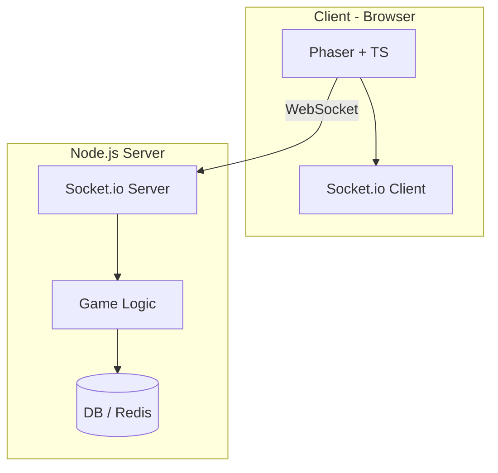

<div align="center">

# 🌌 Project: **LUXFIELD**

<p>
  
  
  
  
  
  
  
  
</p>

</div>

A minimalist real-time strategy game inspired by Auralux. Playable in the browser with a simple interface and a relaxing ambient atmosphere. The player conquers planets by sending luminous unit flows.

---

## 🌟 Project Goals

* [x] Develop a 2D browser game in TypeScript (Auralux-inspired)
* [x] Web support with minimal UI
* [x] Real-time multiplayer via WebSocket (Socket.io)
* [ ] Elegant and minimal aesthetic interface
* [ ] Basic AI for solo mode
* [ ] Easy export (Web + Electron eventually)

---

## ⚙️ Tech Stack

| Layer         | Technology                          | Main Role                        |
| ------------- | ----------------------------------- | -------------------------------- |
| Frontend      | TypeScript + Phaser                 | 2D game engine in the browser    |
| Backend       | Node.js + Express + Socket.io       | Real-time WebSocket game server  |
| DB (optional) | MongoDB / Redis                     | Save, session, matchmaking       |
| Build tools   | Vite or Webpack                     | Fast development & build tooling |
| Hosting       | Vercel (frontend), Render (backend) | Deployment                       |

---

## 📊 General Architecture (Mermaid Diagram)



---

## 🧪 Upcoming Features

* [ ] Multi-planet selection
* [ ] Smooth unit animations
* [ ] Online 1v1 matchmaking
* [ ] Global ranking system
* [ ] Solo campaign mode

---

## 🚀 Quick Start (Development)

```bash
# Backend
npm install
npm run dev

# Frontend (if separated)
cd client/
npm install
npm run dev
```

---

## 🧠 Project Name: **Luxfield**

> *"Lux" for light, "Field" for the interstellar battlefield*
